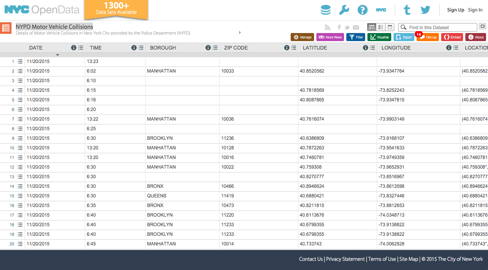
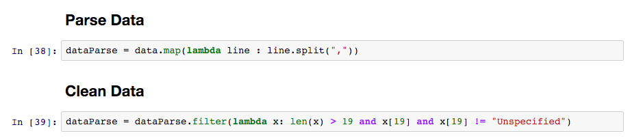
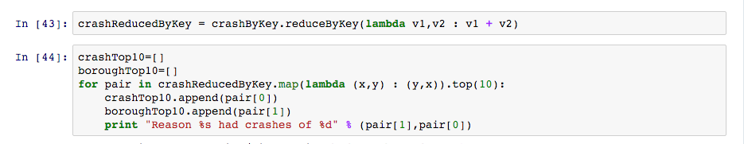
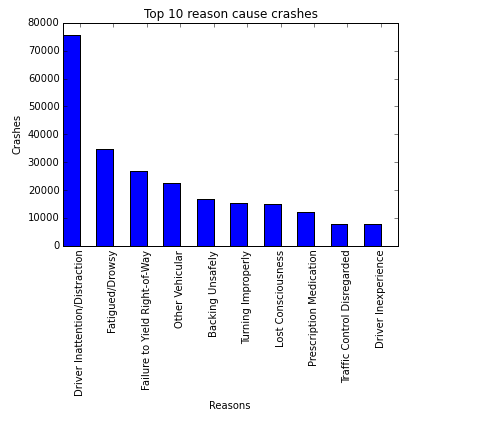

cmpe272-extra-assginment

#Topic: The most dangerous reasons that cause accidents in NY.

#Why do I want to do this?
I am a new driver. Knowing the big reasons could help warn the other drivers and me to avoid crashes. It could also help the pedestrian to avoid injury.

#1.Data Source
I Use NY open data on https://nycopendata.socrata.com, NYPD Motor Vehicle Collisions.
https://data.cityofnewyork.us/Public-Safety/NYPD-Motor-Vehicle-Collisions/h9gi-nx95

#2.Clean Data
There are some empty data and unspecified row in the dataset. I need to remove them.

#3. Explore Data

#4. Draw Histogram

